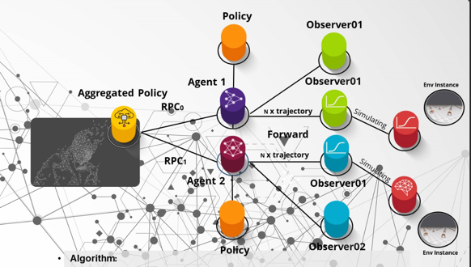
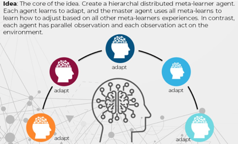

# DH-MAML
Implementation Distribute Hierarchical Meta Reinforce Learner (DH-MAML)
The key idea focused on the Meta Gradient method. MAML and other meta gradient methods.

The main observation is that we can distribute the same meta-tasks to many agents, and each agent 
distributes a set of meta-tasks to many observers. The principal agent and other agents have their own policies.
The agent asks each observer to roll out many trajectories based on many tasks. Each observer collects a required 
number of trajectories and replays back the agent via RPC to agents.  

The agent first sends all trajectories tensor to the device and passes that data to the algorithm.   
For example, in the current implementation, it is MAML and TRPO.   Thus, during the meta-training phase, 
we first perform the adaption phase for an existing policy after the algorithm uses TRPO semantics to compute 
new KL terms for the current policy. Finally, the principal agent receives all updates from all the agents. 

## Architecture




## Instruction.

* Python 3.10
* Torch 1.13
* Cuda 1.17

Make sure you check the conda recipe file; it has all dependencies. 

* Dockerfile contain everything you need run.  If you build container from scatch\

WSL2/Linux

```bash 
clone https://github.com/spyroot/DH-MAML.git
# make sure you are im same directory
ls DH-MAML 
docker run --privileged --gpus all -it --shm-size=1g --ulimit memlock=-1 --ulimit stack=67108864 -v ${PWD}:/code meta_critic:v1 bash
cd /code

(base) root@5e1ef3bb580d:/code/DH-MAML# conda env list
# conda environments:
#
base                  *  /root/miniconda3
meta_critic              /root/miniconda3/envs/meta_critic

 conda activate meta_critic
 pip install gym[all] -U
 pip uninstall mujoco-py
 pip install mujoco -U
 # make sure you have latest 2.2.0 or 2.3.0
```

Note you can run on Windows as well but not native. Currently, the torch distributed doesn't support a window. 
Please remember if you run code in WSL2. Linux subsystem has its own file system. 
That way, I expand the dir in all spec files to a $HOME. i.e., if you run a code in Pycharm or Visual Studio Code. 
A  current dir where IDE executes code if it is set to execute under by WSL2 subsystem. 

```
log_dir: "~/meta_critics/logs/lander_continuous"
model_dir: "~/meta_critics/models/lander_continuous"
create_dir: True
```

Notice at the of dockerfile.   DH-MAML I ported all Mujoco env to the latest version. i.e. it uses direct python binding. 
If you do have mujoco-py, remove it. I ported all gym env's so it all work with new gym API. 

```Dockerfile
RUN conda env create --file /root/conda-recipe.yaml
RUN apt-get install swig -y
RUN pip install gym[all] -U
```

## MacOS 

I tested on MacOS 10.13.1 / Python 3.10 / Conda.  

## High level

Most of the part is heavily utilize multithreading and uses asyncio for distributed RPC. The code developed with new 
asyncio Python 3.10 so please use same version. There are a few bugs in torch.

Specifically, I use torch CUDA RPC. i.e TENSORPIPE. 
* [Details](https://pytorch.org/tutorials/recipes/cuda_rpc.html)
* [Tensoripe](https://github.com/pytorch/tensorpipe)


Each time agent receives trajectories. All tensors are sent to a  target device. At this moment, the torch forces 
to send the tensor to the CPU before you send via RPC ( even if the agent and observers are on the same device).  
You can map agents and observers to separate GPUs if you have more 
than one GPU.   Use **device_maps**

Please also note I do some tricks with policy. For example, an observer doesn't require a gradient step. 
Hence, RemoteSimulator computes policy on CPU,  while Agent runs conjugate gradient and TRPO on GPU.

High level

*  Observer receives async RPC msg from agent with list of task.
*  Observer return future to agent.   It creates asyncio task to remote simulator. 
*  Remote simulator has own policy on CPU.  It collects N trajectories for number of meta tasks.
*  While it collecting trajectories and computing policy gradient.  It push a data to asyncio queue
*  Observer returns all the batch of trajectories to an agent. 
*  Note that agent doesn't wait.  It keeps pushing without waiting to own trainer asyncio queue.
*  The is separate asyncio consumer that consume and push the data to algorithm (TRPO)
*  Note that step when data uploaded to GPU. 

Essential to remember each observer and agent are two different processes. They might be on the same host or other hosts.
When the agent starts, it first registers its RREF in each observer. It also sends the policy to all observers.   
The agent also sends grad for policy. It is not required for TRPO since the observer doesn't need any grads, but if you want running, for example, Running average and combining Memory based (i.e., PPO ), you could do that.

## Meta Testing. 


## Metrics.

* All metrics serialized to tensorboard.  
* I collect KL terms and inner loss during the adaption phase.
* Lost post adaption. 
* I also collect CG ls steps, this step aggregates per batch epoch. This metric is essential to monitor; we don't 
* want CG constantly doing full-depth line searches. Usually, it should take between 2-8 steps.
* Also, note algorithm minimizes the KL term for each meta-task. i.e KL OLD || KL NEW 
* When the algorithm push all loss term. 
* There is another concurrent producer-consumer thread. 

This thread mainly provides busy-free IO. Essentially it is a producer-consumer pattern. The producer absorbs all 
metrics it receives from the trainer and returns back to training without waiting. It is MetricReceiver class. 
The same class pushes all the data to wandb. Again no busy waiting. 
 
When the agent receives the back from the training metric, it computes all rewards.  Agan no busy waiting.   
Since it is a distributed system, we don't want to block it. 

* Location for logs
```yaml
log_dir: "~/meta_critics/logs"
model_dir: "~/meta_critics/models/navigation"
create_dir: True
```

Default settings.  If you want push all metrics to wandb check config spec file.
This mine and you need adjust that.   **use_wandb: True**

```yaml
wandb:
  entity: spyroot
  project: dh-maml

trainer:
  use_wandb: True
  type: distributed_rpc
  save_freq: 20
  meta_test_freq: 20
  use_gae: True
  gamma_factor: 0.99
  gae_lambda_factor: 1.0  # Discount (GAE).
  use_discount_gamma: True
  resume: True
  num-workers: 2
```


## References
This work uses many ideas and the work of many brilliant papers.  
Key paper TRPO
Key MAML
Key paper PPO
torch distribution


These experiments are based on the paper:

> Chelsea Finn, Pieter Abbeel, and Sergey Levine. Model-Agnostic Meta-Learning for Fast Adaptation of Deep
Networks. _International Conference on Machine Learning (ICML)_, 2017 [[ArXiv](https://arxiv.org/abs/1703.03400)]

Make sure you check Stanford CS330. 

* MAML
```
@article{finn17maml,
  author    = {Chelsea Finn and Pieter Abbeel and Sergey Levine},
  title     = {{Model-Agnostic Meta-Learning for Fast Adaptation of Deep Networks}},
  journal   = {International Conference on Machine Learning (ICML)},
  year      = {2017},
  url       = {http://arxiv.org/abs/1703.03400}
}
```

* TRPO

```
@misc{https://doi.org/10.48550/arxiv.1502.05477,
  doi = {10.48550/ARXIV.1502.05477},
  url = {https://arxiv.org/abs/1502.05477},
  author = {Schulman, John and Levine, Sergey and Moritz, Philipp and Jordan, Michael I. and Abbeel, Pieter},
  keywords = {Machine Learning (cs.LG), FOS: Computer and information sciences, FOS: Computer and information sciences}, 
  title = {Trust Region Policy Optimization}, 
  publisher = {arXiv},
  year = {2015},
  copyright = {arXiv.org perpetual, non-exclusive license}
}
```

If you want to cite this implementation:

```
@misc{mus2022dh-mamlrl,
  author = {Mustafa Bayramov},
  title  = {{Distribute Hierarchical Meta Learner in PyTorch}},
  note   = {Available at: https://github.com/spyroot/DH-MAML},
  year   = {2022}
}
```
